# Diseño e Implementación de un Mecanismo Biela-Manivela-Corredera Impreso en 3D con Adquisicion de Datos
Diseño, impresión 3D y análisis cinemático de un mecanismo biela-manivela utilizando Arduino (acelerometría) y software de análisis de video (tracker) para la validación de curvas de velocidad y aceleración.

# Análisis Dinámico de un Mecanismo Biela-Manivela-Corredera en 3D

Este repositorio contiene el desarrollo, fabricación y validación experimental de un mecanismo biela-manivela-corredera. El proyecto integra diseño mecánico, impresión 3D, electrónica con Arduino y análisis de video por computadora.

## 1. Fundamento Teórico

El mecanismo de **biela-manivela-corredera** es un sistema de eslabonamiento diseñado para transformar el movimiento circular en movimiento lineal alternativo o viceversa.

### Definición Técnica
Es un mecanismo de cuatro barras donde uno de los eslabones (la corredera) tiene una articulación de pasador en un extremo y una articulación de deslizamiento (prismática) respecto al eslabón fijo. En este proyecto, el mecanismo se compone de:

1.  **Manivela:** El eslabón que realiza una rotación completa de 360°.
2.  **Biela:** El eslabón que conecta la manivela con la corredera.
3.  **Corredera:** El eslabón que realiza el movimiento de traslación lineal.

## 2. Modelado y Simulación Cinemática

Se realizó el modelado tridimensional y el análisis de movimiento del mecanismo. Esta fase permitió validar el comportamiento dinámico y ajustar las medidas de los eslabones.

### Referencias de Diseño
Para el desarrollo del modelo en SolidWorks, se tomaron como base metodológica los siguientes recursos:

* **Análisis Cinemático - Referencia 1:** [Mecanismo biela - manivela - corredera | Análisis cinemático | SolidWorks](https://youtu.be/6QLbw1xS8sg?si=8fuSzFIXMK4U_QsU)
* **Análisis Cinemático - Referencia 2:** [Simulación de movimiento en Solidworks. Mecanismo biela-manivela](https://youtu.be/_ggUQRI91M0?si=aOPVly7H2sfQ7lVz)

### Simulación en Autodesk Inventor
Se contó con una simulación base configurada a una velocidad angular de **150 RPM (942 deg/s)**, cortesía del **Prof. Efraín Terán**. A partir de este modelo, se obtuvieron las curvas de aceleración características para el punto central de la biela.

  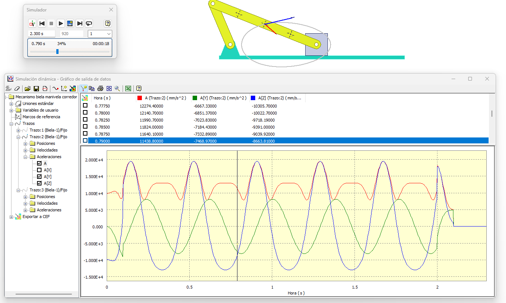
  
<i>Figura 1: Curvas de aceleración del punto central de la biela (Referencia: Prof. Efraín Terán).</i>

  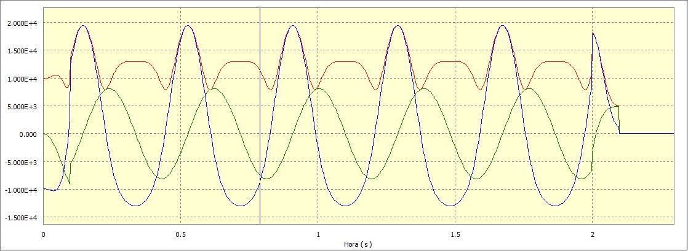
  
<i>Figura 2: Curvas de aceleración del punto central de la biela (Referencia: Prof. Efraín Terán).</i>

> **Nota aclaratoria:** La simulación original se desarrolló con dimensiones menores a las del prototipo final impreso en 3D. Sin embargo, se mantiene la orientación y tendencia de las curvas cinemáticas como patrón de comparación para las pruebas experimentales.

### Resultados Esperados
A través de estas simulaciones se definieron los patrones de referencia para:
1.  **Velocidad Angular**
2.  **Aceleración** 

## 3. Fabricación e Impresión 3D

En esta sección se detallan las consideraciones tomadas para la materialización física del mecanismo. El diseño original fue escalado y modificado para asegurar la funcionalidad mecánica y la facilidad de montaje.

### Archivos de Diseño (CAD)
Los archivos necesarios para la fabricación y edición se encuentran en la carpeta `/cad` del repositorio, organizados de la siguiente manera:

* **Formatos Originales:** Archivos de pieza y ensamble en **SolidWorks 2025**.
* **Formatos de Intercambio (.STEP):** Archivos compatibles con otros softwares de CAD como **Autodesk Inventor**, facilitando su uso académico.

  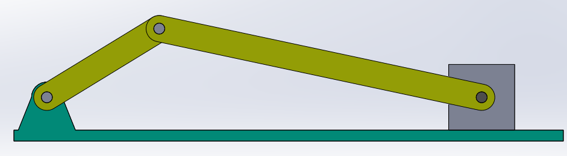
  
<i>Figura 3: Vista del ensamblaje original diseñado en SolidWorks 2025.</i>

### Archivos Optimizados (Versión Final)
Se incluyen las versiones finales de las piezas.

Para asegurar la compatibilidad y facilitar futuras modificaciones, cada componente optimizado se encuentra disponible en dos formatos dentro de la carpeta `/cad/optimizados`:

* **Formato Nativo (.SLDPRT):** Archivos originales de **SolidWorks 2025**.
* **Formato de Intercambio (.STEP):** Archivos universales compatibles con **Autodesk Inventor**, Fusion 360 y otros sistemas CAD.

  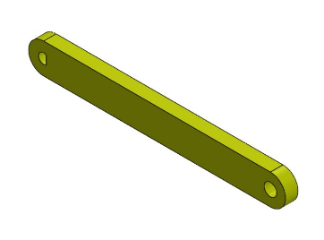
  
<i>Figura 4: Manivela optimizada para acople con motor.</i>

  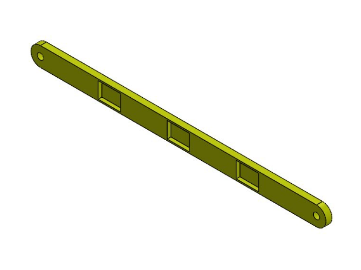
  
<i>Figura 5: Biela con ajuste de tolerancia en los nodos de articulación.</i>

  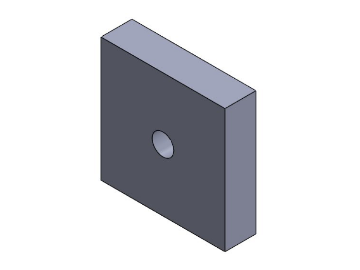
  
<i>Figura 6: Corredera (Pistón) diseñada para deslizamiento de baja fricción.</i>

  
  
<i>Figura 7: Soporte estructural para el motorreductor/actuador.</i>

  
  
<i>Figura 8: Guía lineal para el desplazamiento de la corredera.</i>

### Resultado Final (Prototipo Físico)

Tras el proceso de impresión y ajuste manual, este es el resultado del mecanismo ensamblado y funcional:

  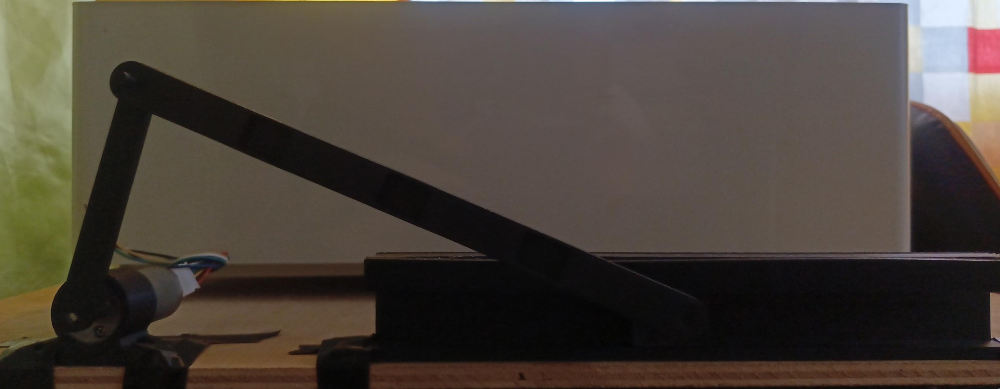
  
<i>Figura 9: Prototipo final impreso en 3D.</i>

### Ajuste de Tolerancias y Montaje
Un aspecto crítico del proyecto fue el ajuste de las dimensiones de los agujeros y ejes para permitir una articulación fluida. 

> **Nota técnica sobre impresión 3D:** Debido a las variaciones en la precisión de las impresoras 3D (contracción del material y resolución de ejes), las dimensiones de los acoples fueron optimizadas mediante un proceso de **prueba y error**. 
> 
> * Se realizaron múltiples iteraciones de impresión para ajustar los diámetros internos de los alojamientos de los pasadores.
> * Se recomienda al usuario verificar la calibración de su impresora antes de proceder con la fabricación completa.

## 4. Metodología Experimental: Adquisición de Datos

Para validar el comportamiento del mecanismo impreso en 3D, se implementó un sistema de adquisición de datos dual que permite contrastar los resultados físicos con los modelos teóricos.

### 4.1. Acelerometría (Hardware)

Se utilizó un sistema electrónico basado en hardware abierto para medir las variaciones de aceleración de la corredera en tiempo real.

#### Materiales Utilizados
* **Microcontrolador:** Arduino UNO.
* **Sensor:** IMU LSM6DS3 (Acelerómetro y Giróscopo).
* **Actuador:** Motorreductor con Encoder integrado.

  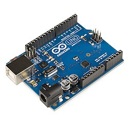
  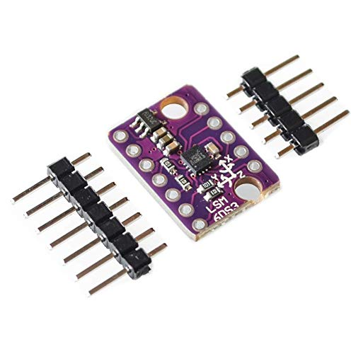
  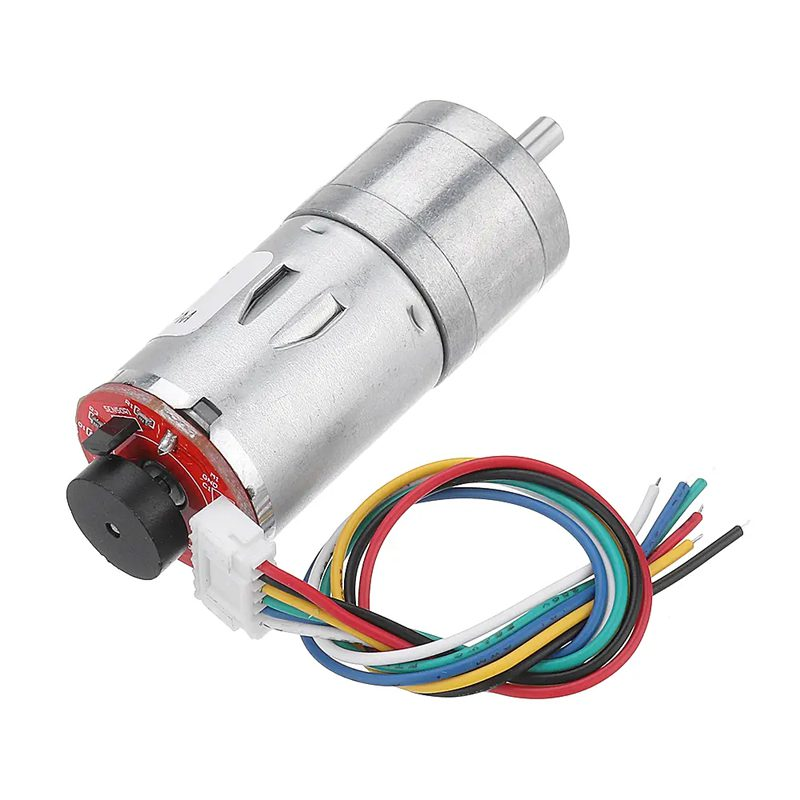
  
<i>Figura 10: Componentes electrónicos principales para la captura de datos.</i>

#### Conexión del Motor y Encoder
El motor cuenta con un encoder integrado para el monitoreo de la velocidad angular. A continuación se detalla la configuración de pines:

  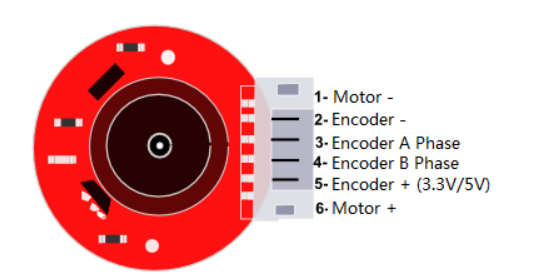
  
<i>Figura 11: Diagrama de pines y conexiones del motor con encoder.</i>

---

### 4.2. Firmware y Software de Procesamiento

El sistema se divide en una etapa de captura (Arduino) y una de procesamiento/visualización (MATLAB/Python). Los códigos se encuentran en la carpeta `/src`.

#### A. Adquisición IMU con Arduino (`/src/arduino`)
El programa utiliza el sensor **LSM6DS3** para adquirir la velocidad angular (Z) y aceleración (X, Y, Z).
* **Calibración:** Realiza un ajuste inicial de *bias* del giróscopo para reducir la deriva.
* **Muestreo:** Frecuencia aproximada de **200 Hz**.
* **Salida:** Formato CSV vía serial (115200 baudios): `t_ms, gz_dps, ax_g, ay_g, az_g`.

#### B. Visualización en Tiempo Real (`/src/matlab` y `/src/python`)
Se desarrollaron scripts para recibir y procesar los datos CSV en vivo.
* **Conversión de Unidades:** De $g$ a $mm/s^2$ (utilizando $1g = 9806.65 mm/s^2$).
* **Compensación Dinámica:** Aplicación de compensación gravitacional en el eje Y ($a_{lineal} = a_{medida} - g$).
* **MATLAB (v. 2025):** Utiliza `serialport` y `animatedline` para gráficas dinámicas.
    * *Nota:* Debido al uso de la versión 2025, versiones anteriores podrían requerir ajustes de compatibilidad en la comunicación serial.
* **Python:** Alternativa **Open Source** que utiliza `pyserial`, `numpy` y `pyqtgraph` para un procesamiento eficiente sin requerir licencias pagadas.

---

### 5. Resultados y Análisis

#### Funcionamiento en Tiempo Real
Vídeo del mecanismo operando con la telemetría activa:

  
  
<i>Video 1: Demostración del prototipo y captura de señales en vivo.</i>

#### Comparativa de Gráficas
A continuación se presentan las curvas de aceleración obtenidas experimentalmente frente a las teóricas de la simulación:

  
  
<i>Figura 12: Resultados finales - Comparativa de Aceleración vs Tiempo.</i>

